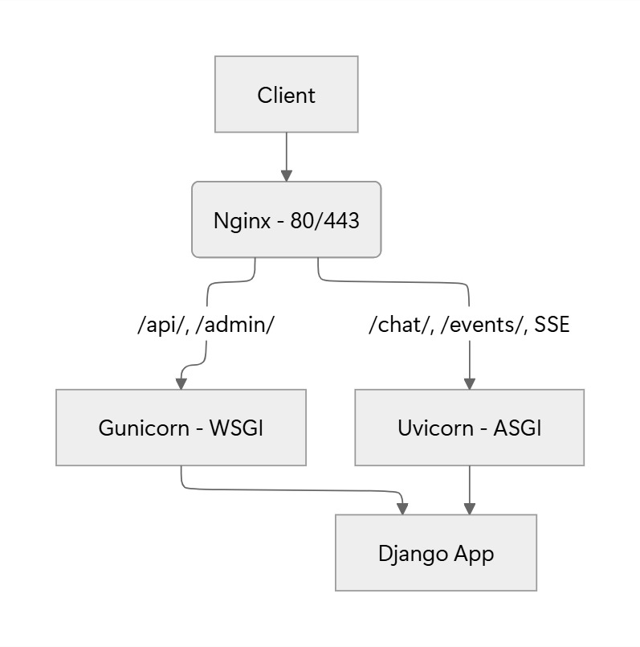
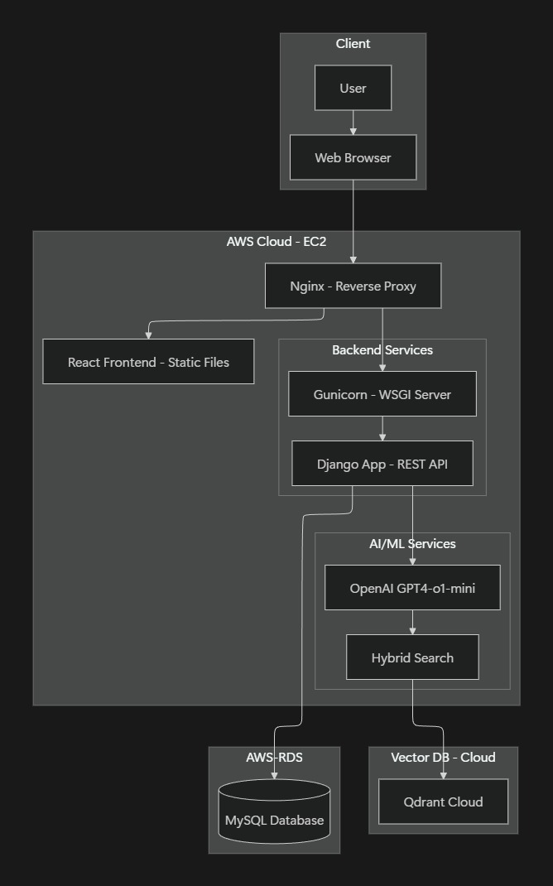
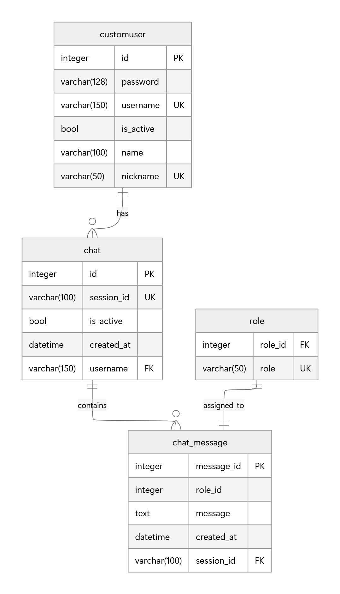

# 🖐️ 팀 소개

- # 팀명 : **명짝**

- <p align="center">
  
</p>

- ### 팀원 소개 :

<div align="center">
	
| [김승룡] | [정덕규] | [이의정] | [진승언] | [이명준] |
| :---: | :---: | :---: | :---: | :---: |
|  |  |  |  |  |
</div>
<br>

- ### 팀원 역할:

  ```markdown
  - 백엔드 (Django build, Django View, Django → Session ) - 덕규
  - 데브옵스(Docker, AWS EC2, Amazon RDS, Nginx) - 승언
  - 프론트( Javascript, React) - 의정
  - AI 에이전트 (django  method 비동기 스트리밍, RAG기반 챗봇 성능개선) - 명준
  - DBA (qdrant, Django model) - 승룡
  ```

---

# 📖 프로젝트 개요

## 주제 : 모두가 관심있어하는, 인류 생존에 가장 중요한 연애! <br> 어떻게 하면 더 나은 연애를 할 수 있을지 상담해주는 AI 기반의 '연애 상담' 챗봇 서비스

- ### **프로젝트 소개**

"**명짝 : 명준(님) 짝꿍구하기**"는 사용자의 연애에 대한 고민을 상담해주는 AI 대화형 챗봇 서비스입니다.**연애를 하면서 생기는 다양한 상황과 질문에 대한 답변를 RAG 기반으로 안내**하며**사용자가 선호하는 연애 유튜버의 말투로 답변**합니다.

- ### **프로젝트 배경**

"연애를 하다보면, 또는 연애를 시작하려고 하면<br>
남들에게 물어보기도 어려운 다양한 상황에 직면하게 됩니다.<br>
이럴 때 저희 AI 챗봇에 물어보면 됩니다.."<br>

## 본 프로젝트가 필요한 이유

### 연애 고민은 혼자 감당하기엔 너무 크다

- 사소해 보여도 감정·자존감·판단력을 흔들며, 주변에 말하기도 어렵다.

### 감정 때문에 생각이 왜곡된다

- 불안, 자기비난, 과한 해석 속에서 스스로 객관화가 힘들다.

### 사람 상담의 한계를 보완한다

- 지인 상담의 편향, 전문가 상담의 비용·접근성 문제를 해결한다.

### 결정 직전 타이밍을 잡아준다

- 연락·답장·이별 같은 순간에 감정 폭주를 막아준다.

### 정답 없는 연애를 구조화해준다

- 상황 분석 → 선택지 → 결과 예측까지 정리해준다.

### 반복되는 연애 패턴을 인식하게 한다

- 기록과 정리를 통해 ‘왜 힘든지’를 언어화하게 돕는다.

<br>


## 💻 기술 스택 & 사용한 모델

| 분야 | 사용 도구 |
| :--- | :--- |
| **Language** |   |
| **Frontend** |   |
| **Backend** |   |
| **Infrastructure** |   |
| **Collaboration Tool** |   |
| **Vector DB** |  |
| **Orchestration** |  |

<br>


## 📂 Project Structure

```text
SKN21_3rd/
├── backend/                        # Django Backend Application
│   ├── account/                    # 사용자 계정 및 인증 앱
│   ├── aws_config/                 # AWS 배포 및 인프라 설정
│   ├── chat/                       # 챗봇 서비스 핵심 로직 앱
│   │   ├── migrations/             # DB 마이그레이션 파일
│   │   ├── models.py               # 채팅 로그 및 페르소나 데이터 모델
│   │   ├── serializers.py          # DRF 데이터 직렬화 설정
│   │   ├── urls.py                 # 채팅 API 엔드포인트 라우팅
│   │   └── views.py                # RAG 로직 및 AI 답변 스트리밍 처리
│   └── config/                     # 프로젝트 메인 설정
│       ├── settings.py             # DB, Qdrant, 보안 환경 설정
│       ├── urls.py                 # 프로젝트 전체 URL 라우팅
│       └── wsgi.py                 # Gunicorn 연동 인터페이스
├── frontend/                       # React Frontend Application
│   ├── public/                     # 정적 리소스 (아이콘 등)
│   ├── src/                        # 프론트엔드 소스코드
│   │   ├── assets/                 # 이미지 및 미디어 자원
│   │   ├── App.jsx                 # 메인 앱 컴포넌트
│   │   ├── App.css                 # 전역 레이아웃 및 테마 스타일
│   │   ├── MainPage.jsx            # 상담가 선택 및 채팅 인터페이스
│   │   ├── MainPage.css            # 채팅 페이지 전용 스타일
│   │   ├── index.css               # 기본 CSS 초기화 및 폰트 설정
│   │   └── main.jsx                # React 엔트리 포인트
│   ├── index.html                  # SPA 메인 HTML
│   ├── vite.config.js              # Vite 빌드 및 프록시 설정
│   └── package.json                # 프론트엔드 의존성 관리
├── utils/                          # E2E 데이터 파이프라인 유틸리티
│   ├── ej_pipeline.py              # 유튜브 자막 수집 및 전처리 파이프라인
│   ├── qdrant_delete.py            # Qdrant 컬렉션 관리 도구
│   ├── qdrant_export.py            # 벡터 데이터 백업 및 추출 스크립트
│   └── export_data.json            # 최종 가공된 데이터셋 예시
├── .env                            # API 키 및 DB 접속 보안 변수
├── manage.py                       # Django 관리 스크립트
├── requirements.txt                # 백엔드 라이브러리 의존성 목록
└── db.sqlite3                      # 개발용 로컬 DB


# 🪢시스템 아키텍처

### 프로젝트 구조****

```markdown
    프론트엔드:
        웹 프레임워크: React 
    백엔드/ AI: 
        프록시: NGINX 
        웹 프레임워크: Django(전통적인 API, 애플리케이션 데이터설계)
        웹 통신 게이트웨이: WSGI
        AI 통신 방식: Django.StreamingHttpResponse 
        RESTFUL api: Django
    배포: 
        Web Server: EC-2 
        RDB: Amazon RDS 
        VectorDB: qdrantcloud
```

### 백엔드 구조도



### 시스템 아키텍처 구조도



---

# DB 스키마



<br>

# 화면설계

<br>

### 1.메인페이지


### 2.채팅화면


### 3.로그인 화면


### 4.회원가입 화면 


# ✒️ 한 줄 회고


| 이름   | 회고 |
| -------- | ------ |
| 김승룡 | 웹으로 연결을 하면서 로컬에서만 돌리는 것과는 많이 다르고 이슈가 많다는 것을 알게 되었고, dba의 어려움에 대해서도 알게 되었습니다. 서버가 생각보다 민감해서 조금만 잘못되도 멈춰버려서 이를 해결하는 과정에서 배우는 점들이 있었습니다.    |
| 정덕규 |      |
| 이의정 |  챗봇을 만들면서 시스템이 어떤 구조로 흐르는지 알게되었고 시간이 없어서 원하는 결과물까지는 도달하지 못했지만 다들 포기하지 않고 끝까지 자기가 맡은 역할에 책임감있게 해주셔서 많이 배우게 되었습니다. 시간이 짧아서 힘들었을텐데 정말 다들 수고하셨습니다!!!|
| 진승언 |   로컬 환경과 배포 환경이 달라 이를 염두한 개발의 어려움과 실제 서비스화 했을 때 발생하는 문제점들 배울 수 있어서 좋았습니다.   |
| 이명준 |  개발자가 반드시 이해해야하는 `설계 - 개발 - 테스트 - 배포`의 전체 흐름을 느낄 수 있어 좋았습니다.   |

